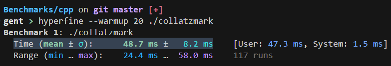
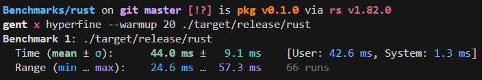
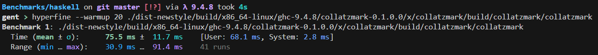
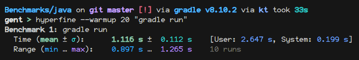
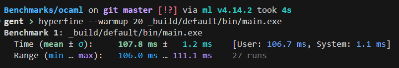
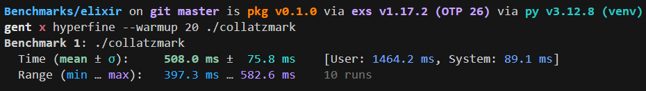
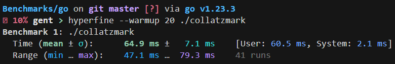
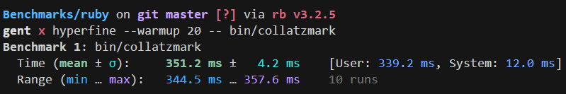

# Collatzmark

Benchmarking using the Collatz conjecture

---

## Why did you make this?

It's fun to see which language is the fastest!

## Why did you choose Collatz conjecture and why only 10000 iterations?

I chose Collatz conjecture because it was brought up in a chatroom
and I thought:

> Why not write Collatz conjecture in Haskell?

So that is what I did. I then, for some reason, tried writing it
in Rust.

What I didn't know was that Godbolt, the tool I used to write
the code for both Collatz conjectures with, was killing itself
because of how much was being printed. I thought it was about
how fast the execution was. Which confused me and I brought it
up in that same chatroom. Someone else there wrote a custom
version which only printed up to 10000 iterations. Using that,
I tried writing another implementation and now we are here.

## Benchmarks?

This is done with `hyperfine`, it does 20 warmup runs before the benchmark.

- C++:
  
  
- Rust:
  
  
- Haskell:
  
  
- Java:
  
  
  
  Not fully accurate as this also includes the building process.
- OCaml:
  
  
- Elixir:
  
  
- Go:
  
  
- Ruby:

  
- Bash:
  
  
