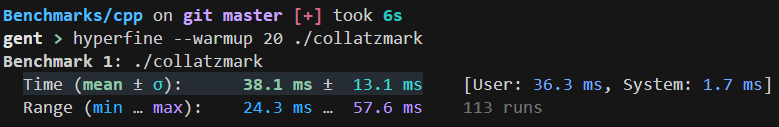

# Collatzmark

## Benchmarking using the Collatz conjecture.

### Why?

It's fun to check and see which language is the fastest! I also got
this idea when Haskell got to iteration 207 before exiting when Rust
only got up to 171.

### Benchmarks?

- C++:
  
  
  
  POSSIBLY WRONG: It doesn't print anything to stdout, so who knows. Maybe it's skipping the operations.
- Rust:
  
  
- Haskell:
  
  
- Java:
  
  
  
  Not fully accurate as this also includes the building process.
- OCaml:
  
  